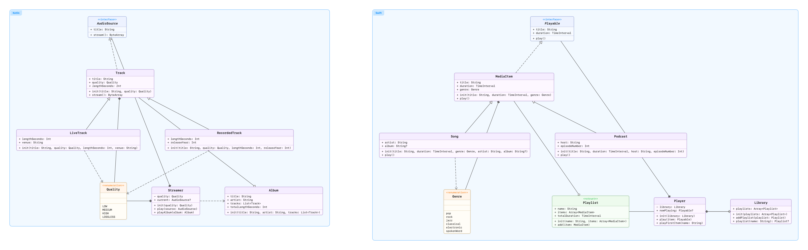
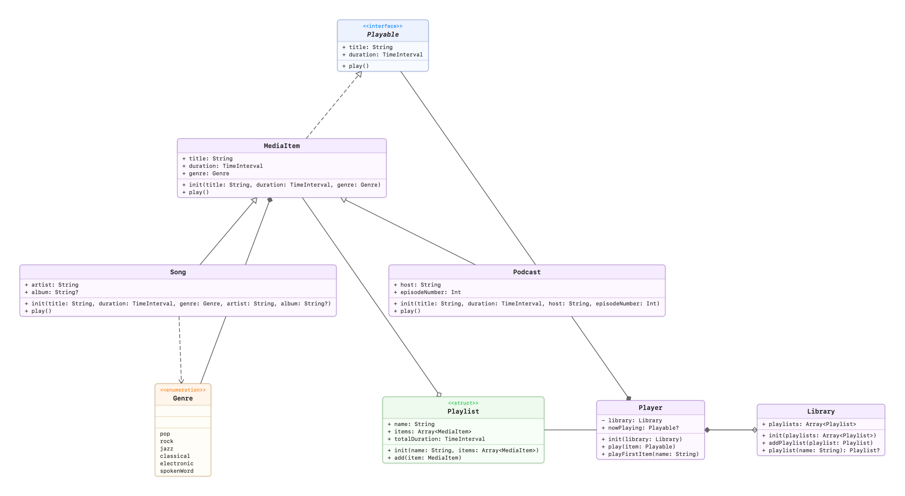
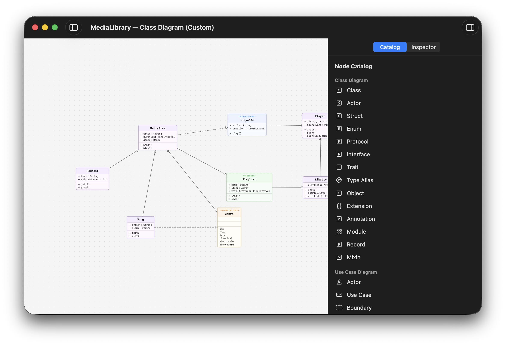

# UML — See Your Codebase

**Point it at a folder. Get a diagram back.** No annotations, no project files, no build step — just your source code, parsed for real and drawn as a UML class diagram. Works across Swift, Kotlin, Java, TypeScript/JavaScript, Dart, Python, C, and C++, all in one picture. Explore it in the native macOS app, or wire the `uml` CLI into your build and docs.

[](https://swift.org)
[](https://www.apple.com/macos/)
[](https://pauljohanneskraft.github.io/UML/)
[](LICENSE)

<p align="center">
  
</p>

<sub>☝️ The macOS app exploring the bundled <a href="Examples/ClassDiagram"><code>Examples/ClassDiagram</code></a> sample.</sub>

---

## The pitch

You've inherited a codebase. Or you're onboarding onto one. Or you just want to remember how the thing you wrote six months ago fits together. UML reads your source the way a compiler's front end would — it **actually parses** it, it doesn't grep for keywords — and builds one unified model of your types and how they relate. Then it draws the picture: the boxes, the members, and the inheritance / composition / dependency arrows between them.

It runs on a folder. Got a polyglot repo with Swift up front and a C core underneath? Point UML at the root and every language lands in the same diagram. Nothing to annotate, no build to run first.

---

## Get started in a minute

### …with the app

```sh
git clone https://github.com/pauljohanneskraft/UML.git
cd UML
./Scripts/app_create.sh && ./Scripts/app_install.sh
open -a UML
```

Then: add a **project**, point a **codebase** at any folder of source, and let it index. Open a **class diagram**, drag the boxes where you want them, fold members away, group by folder or namespace, dial in an access level — the diagram updates live. Happy with the layout? Hit **Export Image** and you get a PNG exactly as you arranged it.

### …or from the command line

```sh
./Scripts/cli_create.sh && ./Scripts/cli_install.sh

# Render any codebase straight to a PNG (macOS):
uml image --source ~/path/to/your/project --output project.png

# …or emit DOT and render it anywhere Graphviz runs:
uml diagram --source ~/path/to/your/project --output project.dot
dot -Tpng project.dot -o project.png    # brew install graphviz
```

No config file required for either path.

---

## What you get

Point UML at the whole repo and every language lands in one diagram, neatly grouped — here the bundled sample's Swift and Kotlin sides, side by side:

<p align="center">
  
</p>

Zoom in on one side for full member detail. Access levels show as `+` / `-`, and the three UML relationships are all here: inheritance (hollow triangle), composition (filled diamond), and dependency (dashed arrow).

<p align="center">
  
</p>

Prefer the shape over the detail? Hide members for an architecture-at-a-glance overview:

<p align="center">
  
</p>

---

## Draw your own, too

Generated diagrams are the fast path, but the app also ships a freeform editor. Drag types, actors, use cases, packages, and notes from the catalog onto an infinite canvas and wire them up by hand — or take a generated diagram and keep editing from there. Sequence, state-machine, and call-graph elements are all in the box.

<p align="center">
  
</p>

---

## Why UML?

- 🌍 **Multi-language out of the box** — one tool for polyglot repos, not six.
- ⚡️ **Zero configuration** — point it at a directory and go.
- 🎨 **Tweak what you see** — filter members, methods, and access levels; group by file or namespace; pick a theme; drag the layout into shape.
- 🖼 **Export to PNG or DOT** — a pixel-perfect image of your on-screen layout, or standard Graphviz you can render anywhere.
- 🤖 **Automatable** — a first-class CLI for CI, docs pipelines, and pre-commit hooks.
- 🧩 **A library underneath** — the whole engine is a set of SwiftPM modules you can build on.

---

## Honest limitations

No tool is magic, and this one is no exception. Worth knowing up front:

- **PNG rendering is macOS-only.** Both the app's **Export Image** and the `uml image` command render through SwiftUI's `ImageRenderer`, which needs a window-server session. On Linux, emit DOT with `uml diagram` and render it with Graphviz (`dot -Tpng`) — that path runs everywhere.
- **It's static analysis.** UML reads source text; it does not run your build, resolve your package graph, or execute anything. Relationships are inferred from what the code *says*, not from a compiler's resolved symbol table.
- **Plain JavaScript is thin.** With no type annotations to read, a JS-only diagram shows little beyond inheritance. TypeScript gives you the full picture; for a JS example see [`Examples/StateDiagram`](Examples/StateDiagram).
- **C is modeled with `struct`s.** C has no classes, so its domain shows up as structs plus composition, and method-receiver analysis maps free functions back to the type they mutate by pointer. Faithful, but it reads differently from the OO languages.

The per-language nuances are documented in detail — and proven with checked-in exports — in [`Examples/README.md`](Examples/README.md).

---

## Supported languages

| Language                | Parser      |
| ----------------------- | ----------- |
| Swift                   | SwiftSyntax |
| Kotlin                  | Tree-sitter |
| Java                    | Tree-sitter |
| TypeScript / JavaScript | Tree-sitter |
| Dart                    | Tree-sitter |
| Python                  | Tree-sitter |
| C                       | Tree-sitter |
| C++                     | Tree-sitter |

Mix and match — UML produces one unified model across all of them. (C and C++ share the `.h` header extension; UML routes each header to the right grammar by its contents.)

---

## The `uml` CLI

Run `uml --help` (or `uml <command> --help`) for the full menu. The essentials:

```sh
uml analyze ./MyProject --output model.json     # Parse code → JSON model
uml store myproj ./MyProject                    # Analyze and stash it under a name
uml list                                        # Show stored analyses
uml metrics --from myproj                       # Counts, coupling, OO metrics as JSON

# DOT / Graphviz output:
uml diagram --from myproj --theme dark --group-by namespace --output app.dot
uml diagram --source ./MyProject --language kotlin --language java

# PNG output, rendered natively (macOS):
uml image --source ./MyProject --grouping directory --output app.png
```

Two ways to get an image, with deliberately different options:

| | `uml diagram` | `uml image` |
| --- | --- | --- |
| **Output** | DOT/Graphviz text | PNG |
| **Grouping** | `--group-by file\|namespace\|none` | `--grouping none\|directory\|product` |
| **Members** | `--show-members` / `--no-show-members` | `--hide-members`, `--min-access <level>` |
| **Styling** | `--theme default\|dark`, `--direction TB\|LR\|BT\|RL`, `--config <yaml>` | `--scale <factor>` |
| **Runs on** | every platform | macOS only |

Both accept `--from <stored-name-or-json>` or `--source <dir>` (with optional repeated `--language`), and both can draw sequence, state, package, and call-graph diagrams via their respective flags. Pair `--config myconfig.yaml` with `diagram` to lock options down for repeatable output.

---

## Image export

UML renders images two ways, for two jobs:

- **In the app — "Export Image."** Renders the diagram *exactly as you've arranged it*: your manual node positions, your resizes, your visibility settings. WYSIWYG, straight to a PNG.
- **On the CLI — `uml image`.** Headless and scriptable, perfect for CI and docs. It runs the same SwiftUI layout and views as the app, so the output matches.

```sh
uml image --source ./MyProject --grouping directory --min-access public --scale 2 --output api.png
```

> **macOS only.** Both paths render through SwiftUI's `ImageRenderer`, which needs a window-server session. On Linux, emit DOT with `uml diagram` and render it with Graphviz (`dot -Tpng`).

The class diagrams in this README were produced by `uml image` from the samples in [`Examples/`](Examples) — see [`Examples/README.md`](Examples/README.md) for the exact commands, plus DOT/PNG exports of every diagram type in all supported languages.

<p align="center">
  
</p>

---

## How it works

UML is a layered Swift package — one module per concern, so you can pull in only what you need:

```
 Source files
     │  per-language parsers (SwiftSyntax / Tree-sitter)
     ▼
 UMLSwift · UMLJVM (Java/Kotlin) · UMLJS · UMLDart · UMLPython · UMLCFamily (C/C++)
     │  one unified model
     ▼
 UMLCore  ──►  UMLLibrary (AnalysisService: discovery + dispatch)
     │                         │
     │                         ├──►  UMLDiagram  →  DOT / Graphviz / Mermaid
     │                         └──►  UMLRender   →  PNG (SwiftUI ImageRenderer + Sugiyama layout)
     ▼
 UMLCLI (uml)  ·  UMLApp (UML.app)  ·  UMLMCP (uml-mcp)
```

- **`UMLCore`** — the data model (`CodeArtifact`, `TypeDeclaration`, `Relationship`, …) and the `CodeParser` protocol. The vocabulary everything else speaks.
- **Per-language parsers** — `UMLSwift` uses SwiftSyntax; `UMLJVM` (Java + Kotlin), `UMLJS`, `UMLDart`, `UMLPython`, and `UMLCFamily` (C + C++) use Tree-sitter (shared helpers live in `UMLTreeSitter`). Each plugin is self-contained — its parser, its language config, its build-system detector.
- **`UMLLibrary`** — the composition root. `AnalysisService` holds the parser registry and dispatches by language; importing this one module gives you everything.
- **`UMLDiagram`** — turns the model into DOT/Graphviz and Mermaid.
- **`UMLRender`** — the diagram views, a Sugiyama hierarchical layout engine, and PNG rendering. Shared by the app and the `uml image` command (Apple platforms only).
- **`UMLMCP`** — a third entry point over `UMLLibrary` (alongside the CLI and app): an in-process [Model Context Protocol](https://modelcontextprotocol.io) server (`uml-mcp`) that exposes the read-only analysis engine as tools an AI agent can call directly. Shipped with the bundled **`code-quality`** Claude Code plugin under [`.claude/plugins/`](.claude/plugins/code-quality), which pairs the server with the `code-quality-audit` methodology skill.

Full module-by-module documentation lives at **[pauljohanneskraft.github.io/UML](https://pauljohanneskraft.github.io/UML/)**.

---

## Use it in your own package

Everything the CLI and app are built on is a reusable library. Add UML as a dependency:

```swift
// Package.swift
dependencies: [
    .package(url: "https://github.com/pauljohanneskraft/UML.git", branch: "main"),
],
targets: [
    .target(
        name: "MyTool",
        dependencies: [
            .product(name: "UMLLibrary", package: "UML"),  // analysis + all parsers
            // or cherry-pick: .product(name: "UMLCore", package: "UML"),
            //                 .product(name: "UMLSwift", package: "UML"),
        ]
    ),
]
```

Then analyze a directory and walk the model:

```swift
import UMLCore
import UMLLibrary

let artifact = try AnalysisService.standard.analyzeProject(
    at: URL(filePath: "/path/to/project"),
    allowedLanguages: [.swift, .kotlin]   // empty = every supported language
)

for type in artifact.types {
    print(type.kind, type.qualifiedName)
}
for relationship in artifact.relationships {
    print(relationship.source, "→", relationship.target, "(\(relationship.kind))")
}
```

From there, `UMLDiagram`'s `DOTGenerator` produces Graphviz, and on Apple platforms `UMLRender`'s `DiagramImageRenderer` produces a PNG.

**Available products:** `UMLCore`, `UMLTreeSitter`, `UMLSwift`, `UMLJVM` (Java + Kotlin), `UMLJS`, `UMLDart`, `UMLPython`, `UMLCFamily` (C + C++), `UMLDiagram`, `UMLLibrary`, and (Apple platforms only) `UMLRender`.

Full API documentation for every module lives at **[pauljohanneskraft.github.io/UML](https://pauljohanneskraft.github.io/UML/)** — start with the [Getting Started](https://pauljohanneskraft.github.io/UML/documentation/umllibrary/gettingstarted) guide. To build the docs locally, run `./Scripts/docs_generate.sh` and serve the output.

---

## Requirements

- **Swift 6** toolchain.
- **macOS 15+** for the app and for `uml image` (native PNG rendering needs a window-server session).
- Libraries and the rest of the CLI run on broader Apple platforms (iOS 16+, tvOS 16+, watchOS 9+, visionOS 1+) and on Linux.
- **Graphviz** (optional) — only to render DOT into images: `brew install graphviz`.

---

## Build from source

```sh
swift build           # Build everything
swift test --parallel # Run the test suite
```

Create and install the binaries with the helper scripts (these build `-c release --arch arm64` and assemble the `.app` bundle):

```sh
./Scripts/cli_create.sh      # Produces `uml`
./Scripts/cli_install.sh     # Installs it on your PATH
./Scripts/cli_uninstall.sh   # Removes it

./Scripts/app_create.sh      # Produces UML.app
./Scripts/app_install.sh     # Installs to /Applications/UML.app
./Scripts/app_uninstall.sh   # Removes it
```

---

## Contributing

Issues and pull requests are welcome. Adding a language is the most common contribution — the existing Tree-sitter parsers under `Sources/UMLDart`, `Sources/UMLPython`, `Sources/UMLCFamily`, and friends are a good template (a `CodeParser` conformance plus an `AnalysisService` registration). CI enforces `swiftlint lint --strict` and `swift test --parallel` on macOS and Linux.

## License

[MIT](LICENSE) © Paul Johannes Kraft
