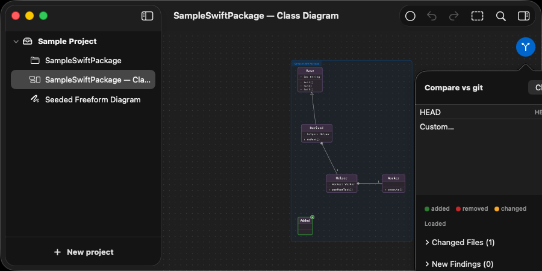
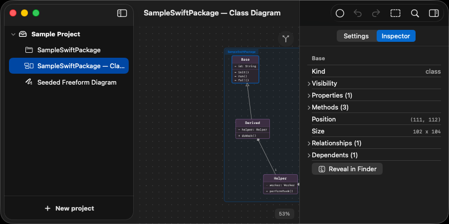
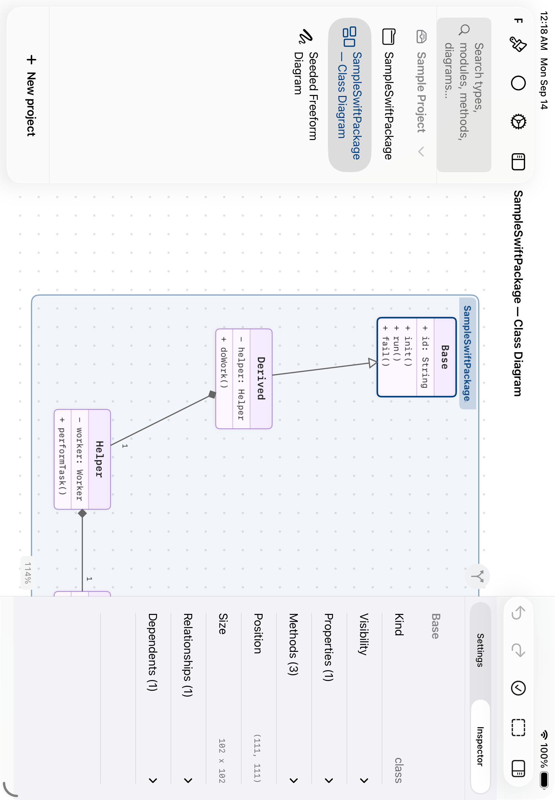
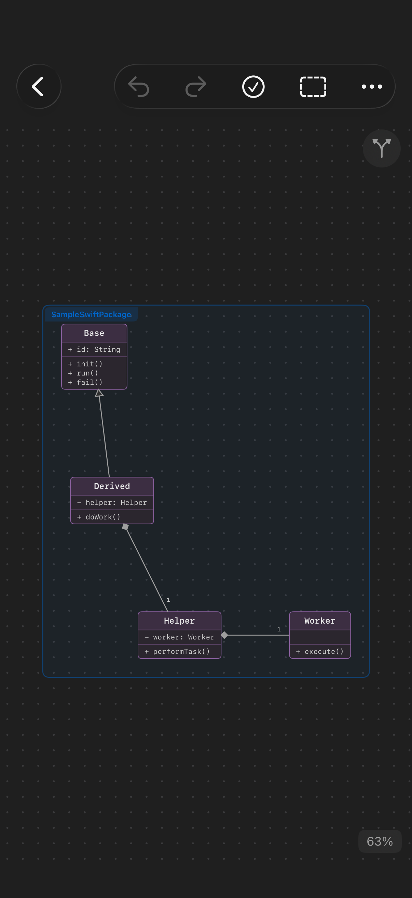
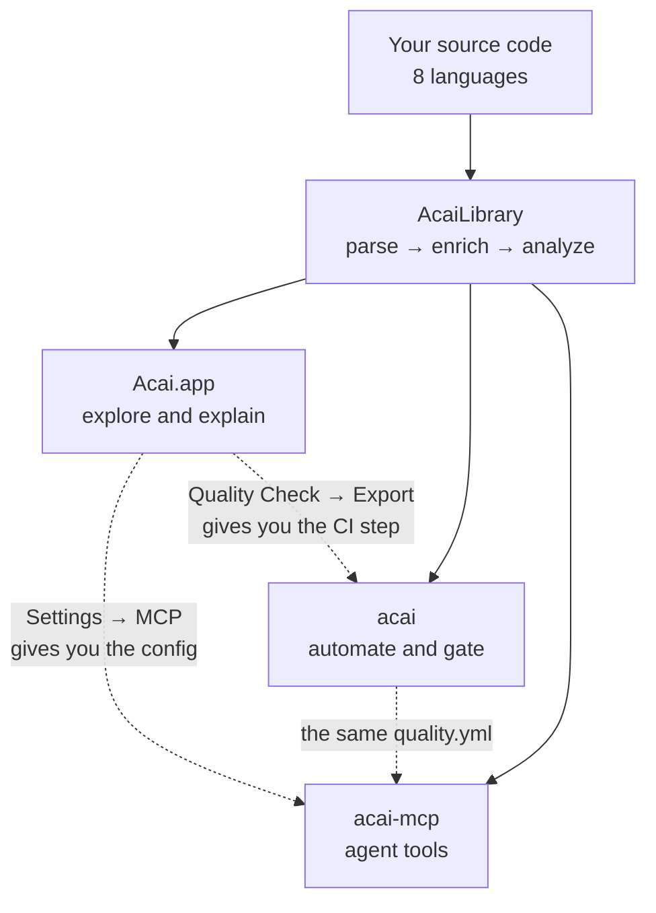

# Açaí — See Your Codebase

**Point it at a folder. Get a diagram back.** No annotations, no project file, no build step — Açaí parses your source the way a compiler's front end would and builds one unified model of your types and how they relate. Swift, Kotlin, Java, TypeScript/JavaScript, Dart, Python, C, and C++ all land in the same picture.

One engine, three ways to use it: a **SwiftUI app** for macOS and iPadOS/iOS, the **`acai` CLI** for your build and docs pipeline, and **`acai-mcp`**, an MCP server that hands the same read-only analysis to a coding agent.

[](https://swift.org)
[](#requirements)
[](https://pauljohanneskraft.github.io/Acai/)
[](LICENSE)

> 📚 **Full API documentation lives at [pauljohanneskraft.github.io/Acai](https://pauljohanneskraft.github.io/Acai/)** — every module, every public type. If you're here to build on Açaí rather than use it, start with the [Getting Started](https://pauljohanneskraft.github.io/Acai/documentation/acailibrary/gettingstarted) guide.

<p align="center">
  
</p>

<sub>☝️ The macOS app exploring the bundled <a href="Examples/ClassDiagram"><code>Examples/ClassDiagram</code></a> sample.</sub>

---

## The pitch

You've inherited a codebase. Or you're onboarding onto one. Or you want to remember how the thing you wrote six months ago fits together.

Açaí **actually parses** your source — SwiftSyntax for Swift, Tree-sitter for the rest — so it knows a `Playlist` holds `[MediaItem]`, not just that the two words appear near each other. From that model it draws class diagrams, call graphs, sequence traces, package graphs and state machines; computes coupling and cohesion metrics; finds dependency cycles and dead code; and diffs two revisions to show you exactly what a change moved.

It runs on a folder. Polyglot repo with Swift up front and a C core underneath? Point Açaí at the root and both land in one diagram, grouped.

---

## Get started in a minute

### …with the CLI

Grab a prebuilt binary from the [latest release](https://github.com/pauljohanneskraft/Acai/releases) — each archive contains both `acai` and `acai-mcp`, for macOS (arm64 / x86_64) and Linux (x86_64 / arm64):

```sh
tar -xzf acai-macos-arm64.tar.gz
sudo mv acai acai-mcp /usr/local/bin/

acai image --source ~/path/to/project --output project.png     # PNG, macOS
acai diagram --source ~/path/to/project --output project.dot   # DOT, everywhere
```

Or build from source: `./Scripts/cli_create.sh && ./Scripts/cli_install.sh`.

### …with the app

```sh
git clone https://github.com/pauljohanneskraft/Acai.git
cd Acai
./Scripts/app_create.sh && ./Scripts/app_install.sh
open -a Acai
```

Add a **project**, point a **codebase** at a folder (or clone one straight from GitHub), let it index, then open a diagram. Drag boxes, fold members away, filter by access level, export a PNG exactly as you arranged it.

### …with an AI agent

Açaí ships a Claude Code plugin that wires up the MCP server and a code-audit skill:

```
/plugin marketplace add pauljohanneskraft/Acai
/plugin install code-quality@acai
```

Your agent gets nine read-only analysis tools — metrics, cycles, dead code, blast radius, diagrams — each answer carrying `file:line` jump targets. See the [`acai-mcp` reference](https://pauljohanneskraft.github.io/Acai/documentation/acaimcp/).

No config file required for any of the three.

---

## What you get

Five diagram families, generated from the same parsed model. These are the checked-in Swift renders from [`Examples/`](Examples) — every language has its own, and they're regenerated and byte-compared by the test suite:

<p align="center">
  
</p>

<sub><b>Class diagram</b> — inheritance (hollow triangle), composition (filled diamond), dependency (dashed), plus multiplicities and <code>+</code>/<code>-</code> access symbols.</sub>

<table>
<tr>
<td width="50%"></td>
<td width="50%"></td>
</tr>
<tr>
<td><sub><b>Call graph</b> — who calls whom, with per-method fan-in/out and dead-code candidates.</sub></td>
<td><sub><b>Sequence diagram</b> — traced from a real entry point through typed properties.</sub></td>
</tr>
</table>

<table>
<tr>
<td width="33%"></td>
<td width="33%"></td>
<td width="33%"></td>
</tr>
<tr>
<td><sub><b>State machine</b> — recovered from assignments to one variable by value-flow analysis.</sub></td>
<td><sub><b>Package diagram</b> — module dependencies with instability and abstractness.</sub></td>
<td><sub><b>Delta</b> — two revisions overlaid: added green, removed red, changed amber. Badged <code>+ − ~</code> too, never colour alone.</sub></td>
</tr>
</table>

Full detail on every sample — per-language coverage, the exact regeneration commands, and DOT/Mermaid/PNG exports of all of them — is in [`Examples/README.md`](Examples/README.md).

---

## Three ways in

### 🖥 The app — macOS and iOS

<p align="center">
  
</p>

Generated diagrams are the fast path; the app is where you go when you want to *work* with them.

- **Eight diagram types** — class, sequence, state, package, call graph, module coupling, hotspots, and cycles.
- **Tune what you see** — show/hide properties, methods and enum cases (globally or per type), set a minimum access level, filter with a selector, group by directory or product, focus on one type and limit the depth. Save a filter as a named preset — or promote it into a quality rule.
- **Freeform editor** — drag classes, actors, use cases, lifelines, states, components and notes onto an infinite canvas. Or hit **Save as Freeform** on any generated diagram and keep editing from there. Named checkpoints let you snapshot a layout.
- **Findings** — quality violations, dead-code candidates and parse diagnostics merged into one project-wide list, each row jumping to source. Suppressions land in a plain, git-reviewable baseline file.
- **Compare revisions** — diff a diagram against a branch, tag, SHA or pull request. The comparison is extracted read-only; your working tree, index and HEAD are never touched.
- **Metrics** — ~25 statistic cards (coupling, OO, smells, structure), a churn × complexity hotspot chart, and a Martin main-sequence plot.
- **GitHub** — sign in with device flow, clone repositories in-app, and share one object store across codebases via linked worktrees.
- **Stays fresh** — local folders are watched and reindexed automatically; quick-open (⌘K on macOS) and Spotlight both search your types.

<table>
<tr>
<td width="50%"><br><sub>Comparing a working tree against <code>HEAD</code>.</sub></td>
<td width="50%"><br><sub>Node inspector on the class-diagram canvas.</sub></td>
</tr>
<tr>
<td width="50%" align="center"><br><sub>Same app on iPad.</sub></td>
<td width="50%" align="center"><br><sub>…and on iPhone.</sub></td>
</tr>
</table>

<sub>Those four are golden screenshots from the UI-test suite, so they're always current — but they show a deliberately tiny fixture, not a real project.</sub>

> **Getting the app.** There's no public TestFlight or App Store link yet. CI uploads both apps to TestFlight on each tagged release, but the reproducible public path today is a local build: `./Scripts/app_create.sh && ./Scripts/app_install.sh` (unsigned). The apps target **macOS 26 / iOS 26**; the libraries and CLI run much wider — see [Requirements](#requirements).

### ⌨️ The `acai` CLI

Twelve commands over the same engine. `acai --help` (or `acai <command> --help`) has the full menu; **the [`acai` reference](https://pauljohanneskraft.github.io/Acai/documentation/acaicli/) is the complete flag-by-flag guide.**

```sh
# Look around
acai analyze --source ./MyProject --health          # can I trust this parse?
acai inspect --source . --kind class --min-members 20
acai impact  --source . Playlist                    # what breaks if I change this?

# Draw
acai diagram --source . --format mermaid --output arch.mmd
acai image   --source . --grouping directory --output arch.png

# Gate
acai quality --source . --rules quality.yml         # exits non-zero on a violation
acai callgraph --source . --mode deadcode

# Review a change
acai diff --source-old ./before --source-new ./after
```

The interesting one is `acai quality`: a declarative `quality.yml` turns your architecture into a fitness function — forbidden dependencies, layering, module-cycle bans, and budgets on 19 metrics. This repo gates itself with the [`quality.yml`](quality.yml) at its root.

### 🤖 The `acai-mcp` server

An [MCP](https://modelcontextprotocol.io) server exposing the read-only engine as nine tools: `acai_analyze`, `acai_metrics`, `acai_quality`, `acai_callgraph`, `acai_inspect`, `acai_impact`, `acai_diff`, `acai_diagram`, and `acai_image` (macOS only). One parse is cached per project path and reused across every call.

```json
{
  "mcpServers": {
    "acai": { "command": "/usr/local/bin/acai-mcp" }
  }
}
```

Reach for it when an agent needs to reason about an unfamiliar or large codebase: it sees what reading files one at a time cannot — global fan-in/out, whole-graph cycles, layering breaches — and returns `file:line` for everything. Bundled with the `code-quality` Claude Code plugin, which pairs the tools with an `audit` methodology skill. Full schemas in the **[`acai-mcp` reference](https://pauljohanneskraft.github.io/Acai/documentation/acaimcp/)**.

---

## How the three fit together

They aren't three products. They're three front doors on one `AcaiLibrary`, so they always agree on what your code looks like:


```mermaid
flowchart TD
    SRC["Your source code<br/>8 languages"] --> LIB["AcaiLibrary<br/>parse → enrich → analyze"]

    LIB --> APP["Acai.app<br/>explore and explain"]
    LIB --> CLI["acai<br/>automate and gate"]
    LIB --> MCP["acai-mcp<br/>agent tools"]

    APP -.->|"Settings → MCP<br/>gives you the config"| MCP
    APP -.->|"Quality Check → Export<br/>gives you the CI step"| CLI
    CLI -.->|"the same quality.yml"| MCP
```

A realistic loop:

1. **Explore in the app.** Open a codebase, look at the class diagram, spot the god class in the hotspot chart.
2. **Turn what you found into a rule.** The diagram's filter has a *Save as Quality Rule* action; the Quality Check editor writes the `quality.yml`.
3. **Export the CI step.** The app's quality-check sheet hands you a ready `- name: Acai quality check` block for GitHub Actions. Now the architecture is a build gate.
4. **Give your agent the same eyes.** Settings → MCP hands you the JSON snippet above. Your agent reads the *same* `quality.yml` through `acai_quality` — so the agent, your CI, and the picture on your screen can't drift apart.

---

## Supported languages

| Language | Parser | Notes |
| --- | --- | --- |
| Swift | SwiftSyntax | Fullest support — includes cyclomatic complexity. |
| Kotlin | Tree-sitter | Full types, members, generics, enum raw values, complexity. |
| Java | Tree-sitter | As Kotlin, plus enum constructor arguments as associated values. |
| TypeScript | Tree-sitter | Interfaces, enums, typed members — the full picture. |
| JavaScript | Tree-sitter | ⚠️ Thin: no type annotations, so little beyond inheritance. |
| Dart | Tree-sitter | Mixins, abstract classes; filters `*.g.dart`, `*.freezed.dart` and friends. |
| Python | Tree-sitter | Attributes from `self.x =` in `__init__`; types from hints; `ABC` → abstract. |
| C | Tree-sitter | ⚠️ Structs + composition — C has no classes. See below. |
| C++ | Tree-sitter | Classes, namespaces, templates; pure-virtual → abstract. |

Mix freely — Açaí produces one unified model across all of them. C and C++ share the `.h` extension, so each header is content-sniffed for structural C++ markers (`::`, `class`, `template`, access labels…) and routed to the right grammar; ambiguous headers stay on C.

Adding a language is a self-contained plugin — see [Contributing](#contributing).

---

## Honest limitations

No tool is magic. Worth knowing up front:

- **PNG rendering is Apple-only.** `acai image` and the app's Export Image both go through SwiftUI's `ImageRenderer`, which needs a window-server session. On Linux the `image` command doesn't exist at all — emit DOT with `acai diagram` and render it with Graphviz (`dot -Tpng`), which runs everywhere.
- **It's static analysis.** Açaí reads source text. It does not run your build, resolve your package graph, or execute anything. Relationships are inferred from what the code *says*, not from a compiler's resolved symbol table — so dynamic dispatch, reflection and code generation are invisible to it.
- **Plain JavaScript is thin.** With no type annotations to read, a JS-only diagram shows little beyond inheritance. TypeScript gives the full picture.
- **C reads differently.** C has no classes, so its domain appears as structs plus composition, and free functions are attributed to the type they mutate by pointer. Faithful, but its abstractions are concrete structs — they don't count toward abstractness the way a C++ pure-virtual class does.
- **Source locations are line-only.** No column information.
- **Dead code is a candidate list, not a verdict.** Always read the reported resolution coverage — low coverage means more false positives.

---

## For developers

### Repository structure

```
Sources/
  AcaiCore/         the language-agnostic model + engine
  AcaiTreeSitter/   shared Tree-sitter helpers
  AcaiSwift/  AcaiJVM/  AcaiJS/  AcaiDart/  AcaiPython/  AcaiCFamily/
                    self-contained language plugins (parser + config + detectors)
  AcaiDiagram/      DOT + Mermaid generation
  AcaiDiff/         structural deltas between two revisions
  AcaiQuality/      the rules engine / architecture fitness function
  AcaiRender/       SwiftUI views, Sugiyama layout, PNG + PDF   (Apple only)
  AcaiLibrary/      composition root — the one import that wires it all up
  AcaiCLI/          the `acai` executable
  AcaiMCP/          the `acai-mcp` executable
  AcaiApp/          the SwiftUI app, shared by macOS and iOS    (Apple only)
  AcaiGit/          libgit2 wrapper — internal to the app       (Apple only)
App/                XcodeGen project, entry points, UI tests + golden screenshots
Examples/           one sample per diagram type, per language, with checked-in exports
Scripts/            build, install, docs, verify, audit
```

Every module carries its prose in a `<Module>.docc` catalog beside its source — that's where the CLI and MCP references live too, so documentation travels with the code it describes rather than in a separate folder that drifts.

### Module map

Every public module has full API docs. Follow a link for the complete surface:

| Module | What it is | Docs |
| --- | --- | --- |
| **AcaiLibrary** | The front door. Wires the nine parsers and ten build-system detectors into `AnalysisService.standard`, and re-exports everything below — usually the only import you need. | [→](https://pauljohanneskraft.github.io/Acai/documentation/acailibrary/) |
| **AcaiCore** | The vocabulary everything speaks: `CodeArtifact`, `TypeDeclaration`, `Member`, `Relationship`, the `CodeParser` protocol, project discovery, and the metric/impact/cohesion analyses. | [→](https://pauljohanneskraft.github.io/Acai/documentation/acaicore/) |
| **AcaiDiagram** | Five diagram families × two text formats (DOT, Mermaid), plus call-graph metrics, method cycles and dead-code scanning. | [→](https://pauljohanneskraft.github.io/Acai/documentation/acaidiagram/) |
| **AcaiDiff** | Structural deltas: what types, members, relationships and metrics changed between two revisions — and the renderable union behind coloured delta diagrams. | [→](https://pauljohanneskraft.github.io/Acai/documentation/acaidiff/) |
| **AcaiQuality** | Selectors, metric budgets, forbidden dependencies, layering, stereotype contracts, cycle detection. Powers `acai quality` and the app's rule editor. | [→](https://pauljohanneskraft.github.io/Acai/documentation/acaiquality/) |
| **AcaiRender** | Sugiyama hierarchical layout, the shared SwiftUI node views, and PNG/PDF output. Apple platforms only. | [→](https://pauljohanneskraft.github.io/Acai/documentation/acairender/) |
| **AcaiTreeSitter** | Traversal, call-site, assignment and field-read helpers shared by the grammar-based parsers. Depend on it only when writing a plugin. | [→](https://pauljohanneskraft.github.io/Acai/documentation/acaitreesitter/) |
| **AcaiSwift** | Swift, via SwiftSyntax. SPM + Xcode detectors. | [→](https://pauljohanneskraft.github.io/Acai/documentation/acaiswift/) |
| **AcaiJVM** | Java **and** Kotlin — one module, since they share the Gradle/Maven detectors. | [→](https://pauljohanneskraft.github.io/Acai/documentation/acaijvm/) |
| **AcaiJS** | TypeScript and JavaScript, one grammar, two parser instances. Node detector. | [→](https://pauljohanneskraft.github.io/Acai/documentation/acaijs/) |
| **AcaiDart** | Dart, with a Flutter/pub detector and generated-file filters. | [→](https://pauljohanneskraft.github.io/Acai/documentation/acaidart/) |
| **AcaiPython** | Python. Vendors the grammar's external scanner (see `Package.swift`). | [→](https://pauljohanneskraft.github.io/Acai/documentation/acaipython/) |
| **AcaiCFamily** | C **and** C++ — shared build systems and grammar family, with `.h` content routing. | [→](https://pauljohanneskraft.github.io/Acai/documentation/acaicfamily/) |

**Entry points** — executables rather than APIs you link against. Each has a full reference on the documentation site:

| Module | | Docs |
| --- | --- | --- |
| **AcaiCLI** | the `acai` command-line tool | [reference →](https://pauljohanneskraft.github.io/Acai/documentation/acaicli/) |
| **AcaiMCP** | the `acai-mcp` MCP server | [reference →](https://pauljohanneskraft.github.io/Acai/documentation/acaimcp/) |
| **AcaiApp** | the SwiftUI app, macOS + iOS | [reference →](https://pauljohanneskraft.github.io/Acai/documentation/acaiapp/) |

**Supporting modules** — internal building blocks you wouldn't normally depend on, documented so nothing in the package is a blank spot: [AcaiGit](https://pauljohanneskraft.github.io/Acai/documentation/acaigit/) (libgit2 wrapper for cloning, revision comparison and churn — Apple platforms only, and **not** a package product, so consumers can't import it), [CPythonScanner](https://pauljohanneskraft.github.io/Acai/documentation/cpythonscanner/) (the vendored Python grammar scanner), and [AcaiPNGComparison](https://pauljohanneskraft.github.io/Acai/documentation/acaipngcomparison/) / [AcaiTestSupport](https://pauljohanneskraft.github.io/Acai/documentation/acaitestsupport/) (test-only helpers).

Every non-test target in `Package.swift` gets a documentation page — `Scripts/docs_generate.sh` reads the target list from the manifest, so a new module is published without touching the script.

### The language-agnostic boundary

This separation is load-bearing, and worth understanding before you contribute:

`CodeArtifact.SourceLanguage` is an **open `RawRepresentable<String>` struct with no built-in constants**. `.swift`, `.python` and friends are declared in their own plugins — so `AcaiCore`, `AcaiDiagram` and `AcaiRender` literally cannot compile a reference to a specific language. A language's quirks (primitives, collection types, framework stereotypes, generated-code filters) live in its `LanguageConfiguration` and reach the engine only by injection, keyed on each artifact's metadata. There is no `switch` over `SourceLanguage` anywhere in an agnostic target.

The payoff: an external package adds a language exactly the way the built-ins do — nothing to patch upstream.

### Use it in your own package

```swift
// Package.swift
dependencies: [
    .package(url: "https://github.com/pauljohanneskraft/Acai.git", branch: "main"),
],
targets: [
    .target(name: "MyTool", dependencies: [
        .product(name: "AcaiLibrary", package: "Acai"),   // analysis + every parser
        // or cherry-pick: AcaiCore, AcaiSwift, AcaiDiagram, AcaiDiff, AcaiQuality, …
    ])
]
```

```swift
import AcaiLibrary

let artifact = try AnalysisService.standard.analyzeProject(
    at: URL(filePath: "/path/to/project"),
    allowedLanguages: []            // empty = every supported language
)

for type in artifact.flattened() {
    print(type.kind, type.qualifiedName, "—", type.members.count, "members")
}

let options = ClassDiagramOptions(languages: artifact.standardLanguageResolver)
let dot = ClassDiagramDOTRenderer(options: options).generate(from: artifact)
```

On Apple platforms, `AcaiRender`'s `DiagramImageRenderer` takes it the rest of the way to a PNG.

**Products:** `AcaiCore`, `AcaiTreeSitter`, `AcaiSwift`, `AcaiJVM`, `AcaiJS`, `AcaiDart`, `AcaiPython`, `AcaiCFamily`, `AcaiDiagram`, `AcaiDiff`, `AcaiQuality`, `AcaiLibrary`, plus `AcaiRender` and `AcaiApp` on Apple platforms.

---

## Requirements

- **Swift 6** toolchain.
- **Libraries + CLI**: macOS 15+, iOS 17+, tvOS 16+, watchOS 9+, visionOS 1+, and Linux.
- **`acai image` / PNG export**: macOS only (needs a window-server session).
- **The apps**: macOS 26 / iOS 26.
- **Graphviz** (optional) — only to turn DOT into images: `brew install graphviz`.

## Build from source

```sh
swift build
swift test --parallel
./Scripts/verify.sh          # build + full test suite + strict lint, in one gate
```

| Script | Does |
| --- | --- |
| `Scripts/cli_create.sh` / `cli_install.sh` / `cli_uninstall.sh` | Build, install, remove `acai` |
| `Scripts/mcp_create.sh` / `mcp_install.sh` / `mcp_uninstall.sh` | Build, install, remove `acai-mcp` |
| `Scripts/app_create.sh` / `app_install.sh` / `app_uninstall.sh` | Build and install `Acai.app` (needs XcodeGen) |
| `Scripts/docs_generate.sh` | Build the DocC site locally |
| `Scripts/audit.sh` | Run a full code-quality audit bundle on any codebase |

---

## Contributing

Issues and pull requests are very welcome.

**Adding a language is the highest-value contribution**, and it's designed to be self-contained: a new target with a parser, its `SourceLanguage` constant, its `LanguageConfiguration`, its build-system detector, and one registration in `AcaiLibrary`. Nothing in an agnostic target changes. The [Adding a Language](https://pauljohanneskraft.github.io/Acai/documentation/acailibrary/addingalanguage) guide walks it through, the existing plugins under `Sources/AcaiDart` and `Sources/AcaiPython` are good templates, and `Tests/AcaiLibraryTests/ParserConformanceChecker.swift` checks the producer-contract invariants every parser must satisfy.

Other good places to start: a language's parser coverage (the capability table above has honest gaps), a new diagram type, or metrics.

Before opening a PR, `./Scripts/verify.sh` should pass — CI enforces `swiftlint lint --strict` and `swift test --parallel` on both macOS and Linux.

## License

[MIT](LICENSE) © Paul Johannes Kraft
